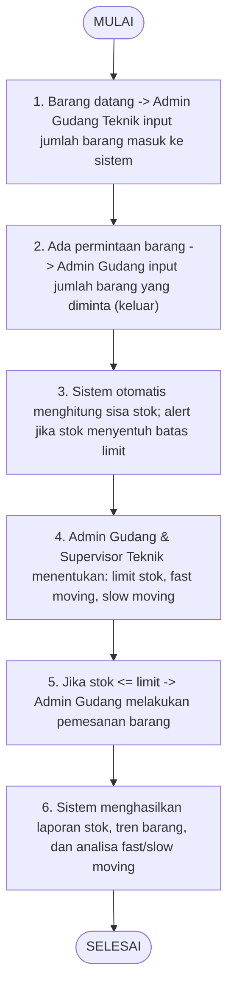

## Project / Sistem

| Project / Sistem | Tujuan | Manfaat |
|---|---|---|
| **System Monitoring Stock Gudang Teknik** | Memonitoring stok barang-barang teknik di gudang teknik | Mengetahui barang masuk/keluar, sisa stok, fast/slow moving, dan batas limit stok |

## Proyek 2: System Monitoring Stock Gudang Teknik

